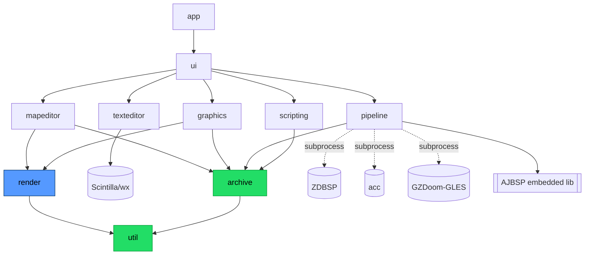

# System architecture

How elads is decomposed into nine modules, how they layer, how data and control flow
through them, and how work is scheduled across the UI thread, worker threads, and external
subprocesses. Read [overview](00-overview.md) first for the vision and strategy; this doc is
the map from that strategy to the `src/` tree.

---

## 1. Design goals that shape the architecture

Three forces drive every structural decision here:

1. **One Pi-specific surface.** The Raspberry Pi 5 GPU (VideoCore VII, Mesa V3D) caps desktop
   OpenGL at 3.1 but offers conformant GLES 3.1. All GL is confined to one module so the rest
   of the app never sees a GL version. See [rpi5-target](09-rpi5-target.md).
2. **Reuse ~80% of SLADE.** We fork SLADE3 and keep its Archive core, Scintilla editor,
   graphics/texture editors, and scripting largely intact; we replace *exactly one* subsystem —
   the renderer — and extend the map editor. See [ADR-0001](../decisions/ADR-0001-fork-slade3.md).
3. **Consume the toolchain as tools, not code.** Node builders, `acc`, and GZDoom are invoked
   as ARM64-clean binaries/libs, never linked-in as source (except embedded AJBSP). See
   [ADR-0007](../decisions/ADR-0007-nodebuilders-toolchain.md).

The result: a **data core with zero GL/UI dependencies**, a thin render abstraction that is the
only place GLES vs desktop-GL matters, and a toolkit layer (wxWidgets) that is the only other
Pi-specific concern.

---

## 2. The nine modules

There are **nine feature modules** (2.1–2.9 below), plus an unnumbered shared-helper
module **`util`** (2.10) that everything may depend on and that itself depends on nothing.
"Nine modules" throughout the docs refers to the nine feature modules; `util` is the
tenth directory but not a feature module.

Directory layout under `src/` (one dir per module; see `src/README.md`):

```
src/
  app/        application lifecycle, config, session, single-instance
  archive/    DATA CORE — WAD/PK3/…, EntryType detection, VFS  (no GL, no wx-UI)
  render/     RENDER ABSTRACTION LAYER — backend/ + gles/ + desktopgl/  (the one new subsystem)
  mapeditor/  model/ + view2d/ + view3d/
  texteditor/ Scintilla 5 + Lexilla lexers
  graphics/   SIFormat loaders + TEXTUREx/TEXTURES editors
  pipeline/   AJBSP/ZDBSP/acc/GZDoom orchestration (subprocesses)
  scripting/  Lua 5.4 + sol2 engine + plugin API
  ui/         wxAUI docking shell, panels, main window
  util/       shared utilities (fs, string, config, logging)
```

### 2.1 `app` — application & lifecycle

- **Responsibility:** process entry point, the `wxApp` subclass, command-line handling,
  single-instance guard, global config load/save, session/workspace state, top-level actions
  and the action-map, crash/exit handling.
- **Reuses/extends:** SLADE `Application`/`App` and its `MainApp` bootstrap; SLADE's action
  and console systems. We keep the wxAUI idle-handling fix here (see [ADR-0003](../decisions/ADR-0003-wxwidgets-toolkit.md)).
- **Public surface:** `App::init()/exit()`, global accessors for config/log/console, the
  action dispatch entry. Owns construction order: `util` → `archive` → `render` device →
  `ui` main window → editor modules.

### 2.2 `archive` — the data core

- **Responsibility:** the *model of truth* for everything on disk. WAD/PK3/ZIP/7z/GRP/PAK/…
  archives, the virtual file tree (VFS), `ArchiveEntry` objects, `EntryType` detection
  (magic-byte + name + parent-dir rules), lump ordering, patch/namespace handling, and the
  archive-manager that tracks open archives and the resource stack. Format read/write lives
  here. See [data-model](03-data-model.md).
- **Reuses/extends:** SLADE `Archive`, the per-format classes (`WadArchive`, `ZipArchive`, …),
  `EntryType`/`EntryDataFormat`, and `ArchiveManager` — reused **verbatim** wherever possible.
  This is the largest single block of inherited code.
- **Public surface (intent, not exact SLADE signatures):**
  ```cpp
  // illustrative — describes intent, not authoritative SLADE API
  class Archive {
  public:
    bool                 open(std::string_view path);
    bool                 write(std::string_view path);
    ArchiveEntry*        entryAtPath(std::string_view vfsPath);
    ArchiveDir*          rootDir();
    Signal<ArchiveEntry&> onEntryModified;   // observers: ui, editors
  };
  ```
- **Hard rule:** this module links **no** GL, no wxWidgets *UI* (it may use wxBase for
  files/strings under `util`), and no editor. Everything above depends on it; it depends on
  nothing above `util`.

### 2.3 `render` — the Render Abstraction Layer (the core investment)

- **Responsibility:** a thin device/context/viewport/shader/buffer/texture/framebuffer
  interface that *every* visual module draws through, so nothing hard-depends on a GL version.
  It **lowers** SLADE's legacy GL idioms (`glBegin`/`GL_QUADS`, display lists, fixed-function
  fog, `GL_POINT_SPRITE`, double-precision verts) to shader triangles, `gl_PointCoord`, UBO
  fog, and floats. Reference implementation model: GZDoom `src/common/rendering/gles`.
- **Reuses/extends:** **new code.** This is the one subsystem elads authors from scratch.
  SLADE's OpenGL layer is the behavioural spec (what must be drawn), not the implementation.
- **Sub-parts:**
  - `backend/` — the abstract interface (headers) + shared helpers (shader cache, state
    tracking).
  - `gles/` — **primary** backend: GLES 3.1 / GLSL ES 3.10 (`#version 310 es`). Only conformant
    HW-accelerated path on the Pi 5.
  - `desktopgl/` — fallback: desktop GL 3.1 core, plus a Zink-over-Vulkan variant for desktop.
- **Public surface (illustrative):**
  ```cpp
  // illustrative RAL interface — see docs/design/02-render-abstraction.md for the real spec.
  // The canonical names are IRenderDevice (resource creation + caps) and a separate
  // IRenderContext (per-frame command recording); 02 is authoritative.
  struct IRenderDevice {
    virtual BufferHandle   createBuffer(BufferType, Span<const std::byte>) = 0;
    virtual TextureHandle  createTexture(const TextureDesc&) = 0;
    virtual ShaderHandle   createProgram(const ShaderSources&) = 0;
    virtual Caps           caps() const = 0;          // GLES vs GL, SSBO/compute available?
  };
  // IRenderContext records draws against a Viewport (see 02 §3).
  ```
- **Detail:** [render-abstraction](02-render-abstraction.md) and
  [ADR-0002](../decisions/ADR-0002-gles31-render-backend.md).

### 2.4 `mapeditor` — 2D + 3D map editor

- **Responsibility:** map authoring toward Ultimate Doom Builder parity. UDB is a UX/feature
  reference only — no C# copied. Split into:
  - `model/` — the in-memory map model (**`MapModel`**, reusing SLADE `SLADEMap`):
    vertices/linedefs/sidedefs/sectors/things, UDMF in/out, selection sets, snapping,
    undo/redo. **UI/GL-free.** (`MapModel` is the canonical name across the docs; see
    [data-model](03-data-model.md).)
  - `view2d/` — the 2D grid editor (extends SLADE `MapRenderer2D`) rendered via `render`.
  - `view3d/` — the "visual mode" walkthrough (extends SLADE `MapRenderer3D`) via `render`.
- **Reuses/extends:** SLADE `SLADEMap`/`MapEditContext`, `MapRenderer2D`/`MapRenderer3D`,
  the item/selection code — extended and re-pointed at the RAL. Sector tessellation uses
  `earcut.hpp` (see [ADR-0008](../decisions/ADR-0008-earcut-triangulation.md)).
- **Public surface (illustrative):** `MapEditContext::openMap(Archive&, MapDesc)`,
  `edit()/select()/commit()`, `Renderer2D::draw(Viewport&)`, `Renderer3D::draw(Camera&)`.
- **Detail:** [map-editor](04-map-editor.md), map model in [data-model](03-data-model.md).

### 2.5 `texteditor` — code/script editor

- **Responsibility:** the Scintilla-backed editor for ZScript/DECORATE/ACS/MAPINFO/CVARINFO/
  Lua/etc., data-driven syntax lexers, calltips/autocomplete, and code folding. (Semantic
  go-to-definition needs a ZScript grammar/LSP and is deferred to a later phase — see
  [text/script editor](05-text-script-editor.md) §8.)
- **Reuses/extends:** SLADE `TextEditor`/`TextLanguage` + its data-driven lexer definitions,
  on **Scintilla 5 + Lexilla**. Reused close to verbatim — Scintilla is a wx-native control and
  version-independent of GL.
- **Public surface:** `TextEditorPanel(entry)`, language auto-selection from `EntryType`,
  the calltip/autocomplete providers (fed by ZScript/actor data from `scripting`+`archive`).
- **Detail:** [text-script-editor](05-text-script-editor.md).

### 2.6 `graphics` — graphics & texture editor

- **Responsibility:** decode/encode Doom gfx (patches, flats, PNG, and other `SIFormat`s),
  palettes/COLORMAP/PLAYPAL, and the composite-texture editors for both classic **TEXTUREx +
  PNAMES** and ZDoom **TEXTURES**. Preview surfaces render through `render`.
- **Reuses/extends:** SLADE `SImage`/`SIFormat`, `Palette`, `CTexture`/`TextureXList`, and the
  gfx/texture editor panels. Decoders are pure CPU (belong logically near the data core); only
  the *preview canvas* touches `render`.
- **Public surface:** `SImage::open(entry)`, `SImage::toRGBA(palette)`, `TextureXEditor(...)`,
  `TexturesEditor(...)`.
- **Detail:** [graphics-texture-editor](06-graphics-texture-editor.md), formats in
  [formats-reference](08-formats-reference.md).

### 2.7 `pipeline` — node build + ACS compile + playtest

- **Responsibility:** orchestrate the ARM64-clean toolchain. **Node building** via embedded
  AJBSP (in-process; standard/GL/XNOD) and bundled ZDBSP (external; XGL2/XGL3/UDMF for GZDoom).
  **ACS** via `acc` out-of-process, only when a map uses ACS. **Playtest** via one-click GZDoom
  launch on its GLES backend, capturing stdout to surface script/asset errors.
- **Reuses/extends:** SLADE's node-builder integration & `nodebuilders.cfg` config model; the
  rest (subprocess plumbing, log parsing, one-click test) is new. AJBSP is the one *linked* tool
  (a lib); ZDBSP/acc/GZDoom are external processes.
- **Key facts baked in:** ZDBSP's x86 SSE classifier files are auto-excluded on 64-bit by its own
  CMake (gated on 32-bit) → clean scalar build on aarch64. `acc` is ~99% portable, endianness-safe
  C. GZDoom rebuilds nodes at load, so external ZDBSP is for pre-baking / other engines; GZDoom
  renders on the Pi only via its GLES backend (`+vid_preferbackend 3`, mainlined ~4.8) and needs a
  live GL context (no headless compile-validate mode).
- **Public surface (illustrative):**
  ```cpp
  // illustrative — async subprocess orchestration
  Task<NodeResult>  buildNodes(const MapData&, NodeFormat);   // AJBSP in-proc OR ZDBSP subproc
  Task<AccResult>   compileAcs(ArchiveEntry& src);            // acc subprocess
  RunHandle         playtest(const PlaytestSpec&);            // GZDoom subprocess, stdout captured
  ```
- **Detail:** [build-test-pipeline](07-build-test-pipeline.md).

### 2.8 `scripting` — Lua/sol2 engine + plugins

- **Responsibility:** the Lua 5.4 runtime (via sol2), the elads scripting API surface bound to
  archive/graphics/map objects, the plugin loader, and the ZScript/actor-definition parser that
  feeds Thing browsers and text-editor autocomplete.
- **Reuses/extends:** SLADE `Scripting`/`Lua` bindings, extended with map-editor bindings. See
  [ADR-0006](../decisions/ADR-0006-lua-sol2-plugins.md).
- **Public surface:** `Lua::run(script)`, the bound API tables (`Archives`, `Graphics`, `Map`, …),
  `PluginManager::loadFrom(dir)`.
- **Detail:** [text-script-editor](05-text-script-editor.md).

### 2.9 `ui` — wxAUI docking shell

- **Responsibility:** the main window, wxAUI docking layout, the archive/entry tree panel,
  editor host tabs, menus/toolbars/status bar, dialogs, and wiring UI events to module actions.
  This is where wxWidgets is a hard dependency and where the wx event loop lives.
- **Reuses/extends:** SLADE `MainWindow`, `ArchivePanel`, `EntryPanel` family, the wxAUI manager.
- **Public surface:** `MainWindow`, panel factories keyed on `EntryType`, the AUI perspective
  save/restore. All heavy visuals embed a `render`-backed `wxGLCanvas` (EGL path).

### 2.10 `util`

Shared, dependency-free helpers: filesystem, string, config/parser (SLADE `Parser`/`Tokenizer`),
memory chunks, logging. Reuses SLADE `Utility`. Everything may depend on `util`; `util` depends on
nothing in-project.

---

## 3. Layering & dependency direction

**Dependencies point inward.** The data core is the innermost ring and knows nothing about GL or
UI. Only two surfaces are Pi/hardware-specific: the **toolkit** (wxWidgets) and the **render
backend** (GLES/desktop-GL). Everything else is portable C++17.

```
        ┌─────────────────────────────────────────────────────────────┐
        │  ui  (wxAUI shell)      ← Pi-specific surface #1: wxWidgets  │
        │  ┌───────────────────────────────────────────────────────┐  │
        │  │  editor modules                                        │  │
        │  │   mapeditor(view2d/view3d) · texteditor · graphics ·   │  │
        │  │   pipeline · scripting                                 │  │
        │  │  ┌─────────────────────────────────────────────────┐  │  │
        │  │  │  render  (RAL: backend/ + gles/ + desktopgl/)   │  │  │
        │  │  │  ← Pi-specific surface #2: the GL backend       │  │  │
        │  │  │  ┌───────────────────────────────────────────┐  │  │  │
        │  │  │  │  DATA CORE                                │  │  │  │
        │  │  │  │   archive  ·  mapeditor/model  · graphics │  │  │  │
        │  │  │  │   decoders  (NO GL, NO UI)                │  │  │  │
        │  │  │  │  ┌─────────────────────────────────────┐  │  │  │  │
        │  │  │  │  │  util  (fs/string/config/log)       │  │  │  │  │
        │  │  │  │  └─────────────────────────────────────┘  │  │  │  │
        │  │  │  └───────────────────────────────────────────┘  │  │  │
        │  │  └─────────────────────────────────────────────────┘  │  │
        │  └───────────────────────────────────────────────────────┘  │
        │  app  (lifecycle) wires the rings together at startup        │
        └─────────────────────────────────────────────────────────────┘

   arrows of dependency all point INWARD ───▶ toward util/archive
   external processes (ZDBSP, acc, GZDoom) hang off `pipeline` via IPC, not linkage
```

The same, as a module graph:



### 3.1 Dependency-direction rules (enforced, not aspirational)

| # | Rule | Rationale |
|---|------|-----------|
| R1 | `archive`, `mapeditor/model`, `graphics` decoders, `util` **must not** include any GL header or `render` header. | The data core stays portable and testable headless; GL is confined. |
| R2 | Only `render` (and the visual `view2d`/`view3d`/preview canvases that draw *through* it) may include GL/EGL. | One Pi-specific GL surface. |
| R3 | Only `ui` (plus `wxGLCanvas` host code and Scintilla) may include wxWidgets *UI* headers. `util`/`archive` may use wxBase (files/strings) but no widgets. | One Pi-specific toolkit surface. |
| R4 | Editor modules depend on the RAL **interface** (`render/backend`), never on `gles/` or `desktopgl/` concretes. Backend is selected at runtime by `app`. | Backend-swappability; no compile-time GL-version lock-in. |
| R5 | `pipeline` talks to ZDBSP/acc/GZDoom **only** via subprocess IPC (argv + captured stdout/stderr + files), never by linking their code. AJBSP is the sole embedded exception (a library). | Licensing cleanliness + ARM64 portability ([ADR-0007](../decisions/ADR-0007-nodebuilders-toolchain.md)). |
| R6 | No module depends "outward" (inner rings never include outer-ring headers). No cycles. | Keeps the layering a DAG; enables unit tests of the core with no display. |

These rules make two properties fall out for free: (a) the data core builds and unit-tests with
**no display and no GL** (CI can exercise archive/format/map-model logic headless), and (b) porting
to a different render target (e.g. Vulkan/V3DV later) touches only `render`.

---

## 4. Data flow: open → browse/edit → map → build → playtest

End-to-end walk-through of the primary workflow, naming the module at each hop.

```
 disk (.wad/.pk3)
    │  open
    ▼
 archive ───────────────► EntryType detection ──► VFS tree
    │  entries                (archive)              │
    │                                                ▼
    │                                    ui: entry tree panel + tabs
    │                                                │ user double-clicks
    │             ┌──────────────┬───────────────────┼───────────────┬────────────┐
    ▼             ▼              ▼                    ▼                ▼            ▼
 graphics     texteditor     mapeditor            (raw/hex)       scripting    ...
 (gfx/tex)    (ZScript…)     model → view2d/3d                    (Lua/ZS parse)
    │             │              │  edit geometry (UDMF)
    │             │              │  commit → mapeditor/model (undo-tracked)
    │             │              ▼
    │             │           pipeline.buildNodes()  ── AJBSP (in-proc) or ZDBSP (subproc)
    │             │              │  + pipeline.compileAcs() ── acc (subproc) if ACS present
    │             │              ▼
    │             │           write map+nodes+behavior back into a temp/target archive (archive)
    │             │              │
    │             ▼              ▼
    └────────► pipeline.playtest() ── GZDoom-GLES subprocess (+vid_preferbackend 3)
                   │  argv: -iwad … -file … (-warp N | +map NAME) -stdout
                   ▼
               stdout/stderr captured → parsed → surfaced in ui log panel
```

Narrative:

1. **Open archive.** `ui` invokes `archive.open(path)`. `archive` parses the WAD/PK3 directory,
   builds the VFS, and runs `EntryType` detection over each entry (magic bytes + name +
   parent-namespace rules). Detection is CPU-bound and can run incrementally / on a worker for
   large PK3s (§5).
2. **Browse/edit entries.** `ui` shows the VFS tree. Double-clicking an entry picks an editor
   panel by `EntryType`: `graphics` for gfx/textures, `texteditor` for scripts/markup,
   `mapeditor` for a map header, hex for unknown. Edits mutate the `archive` entry (or the map
   model) and raise `onEntryModified`, which `ui` reflects (dirty markers).
3. **Edit map.** `mapeditor/model` loads geometry from the map lumps (or UDMF `TEXTMAP`).
   `view2d` draws it through `render`; edits go through the undo-tracked model. Sector fills are
   triangulated with earcut for the RAL.
4. **Build nodes / compile ACS.** On save-for-test, `pipeline` serializes the map, runs node
   building (AJBSP in-process for interactive builds; ZDBSP subprocess for XGL2/3/UDMF
   pre-bakes), and — only if the map references ACS — runs `acc` to produce `BEHAVIOR`/library
   lumps. Results are written back into the target archive via `archive`.
5. **Playtest in GZDoom.** `pipeline.playtest()` launches GZDoom as a subprocess on its GLES
   backend with the assembled IWAD + file set and a warp target, capturing `-stdout`. The log
   is parsed for script/asset errors and shown in `ui`. GZDoom is also the *authoritative*
   ZScript/DECORATE validator (no headless mode — it needs a live GL context).

---

## 5. Threading & process model

wxWidgets is single-threaded for UI: **all widget access happens on the wx main (GUI) thread.**
elads keeps three tiers of concurrency, and everything that isn't a quick UI action is pushed off
the GUI thread so the editor never blocks.

```
 ┌───────────────────────────────────────────────────────────────────────┐
 │ wx MAIN / GUI THREAD                                                    │
 │  · event loop, all widget + wxGLCanvas (single GL context) access       │
 │  · fast model edits, hit-testing, per-frame draw submission             │
 │  · marshals results back from workers/subprocs via wxThreadEvent/CallAfter│
 └───────────▲───────────────────────────────▲──────────────────▲─────────┘
             │ post events                    │ post events      │ async read
   ┌─────────┴─────────┐          ┌───────────┴────────┐   ┌─────┴───────────────┐
   │ WORKER THREADS     │          │ (same worker pool) │   │ SUBPROCESSES (async)│
   │ · sector triangul. │          │ · EntryType detect │   │ · ZDBSP  (nodes)    │
   │   (earcut)         │          │   of large PK3s    │   │ · acc    (ACS)      │
   │ · ZScript/DECORATE │          │ · gfx decode/thumb │   │ · GZDoom (playtest &│
   │   parse            │          │                    │   │   ZScript validate) │
   └────────────────────┘          └────────────────────┘   └─────────────────────┘
        results marshalled back to GUI thread; NO widget/GL touch off-thread
```

Rules of the model:

| Work | Where it runs | Why |
|------|---------------|-----|
| Widget updates, GL draw calls, the single GL context | **wx GUI thread only** | wx + wxGLCanvas EGL context are not thread-safe; one context bound to the GUI thread. |
| Sector triangulation (earcut), ZScript/actor parse, large-archive `EntryType` detection, gfx decode/thumbnails | **worker threads / incremental idle** | CPU-bound; must not stall the UI. Big PK3 loads run incrementally or on a pool. |
| Node building (AJBSP) | **in-process**, worker thread for large maps | AJBSP is embedded and fast; small maps can build synchronously, large ones on a worker. |
| Node building (ZDBSP), ACS compile (`acc`), GZDoom playtest & validation | **external subprocesses, async** | ARM64-clean tools consumed as binaries; keeps GPLv3 boundary clean and the UI responsive. |

Subprocess discipline (in `pipeline`):

- Launched non-blocking (async), argv-driven, working in a temp dir; **stdout/stderr are captured**
  and streamed back to the GUI thread for the log panel (GZDoom `-stdout`; `acc`/ZDBSP diagnostics).
- Completion, exit code, and parsed diagnostics are marshalled to the GUI thread via
  `wxThreadEvent`/`CallAfter`-style posting — never by touching widgets from the child-watcher.
- GZDoom needs a **live GL context** and has no headless compile-validate mode, so validation is a
  real (optionally windowed/short-lived) run, not an API call. See
  [build-test-pipeline](07-build-test-pipeline.md).

Off-thread work marshals results back with wx thread events; **no worker or subprocess watcher ever
touches a widget or the GL context directly.**

---

## 6. Sequence sketches

### 6.1 Open archive + detect entry types

```
User        ui              archive            worker pool        graphics/text
 │  open .pk3 │                │                    │                  │
 ├───────────►│  open(path)    │                    │                  │
 │            ├───────────────►│                    │                  │
 │            │                │ parse dir / VFS    │                  │
 │            │                ├───────────────────►│ detect types     │
 │            │                │  (incremental)     │ (magic+name)     │
 │            │  tree (partial)│◄───────────────────┤                  │
 │            │◄───────────────┤  progress events   │                  │
 │  see tree  │                │                    │                  │
 │◄───────────┤                │                    │                  │
 │ dblclick   │                │                    │                  │
 │  gfx entry │  pick panel by EntryType            │                  │
 ├───────────►│────────────────────────────────────┼─────────────────►│ decode
 │            │                │                    │   thumbnail/RGBA │ (worker)
 │  preview   │◄───────────────────────────────────┼──────────────────┤ → render canvas
 │◄───────────┤                │                    │                  │
```

### 6.2 One-click playtest

```
User      ui           mapeditor/model     pipeline            archive     GZDoom(subproc)
 │  ▶Test  │                │                  │                   │            │
 ├────────►│  playtest()    │                  │                   │            │
 │         ├───────────────►│ serialize map    │                   │            │
 │         │                ├─────────────────►│ buildNodes()      │            │
 │         │                │                  │  AJBSP in-proc /   │            │
 │         │                │                  │  ZDBSP subproc     │            │
 │         │                │                  ├── compileAcs()? ──►│ acc subproc│
 │         │                │                  │  write map+nodes ─►│ temp WAD   │
 │         │                │                  ├───────────────────────────────►│ launch
 │         │                │                  │  argv -iwad -file -warp -stdout │ (GLES)
 │         │  log lines      │                 │◄── stdout captured ─────────────┤
 │         │◄───────────────────────────────── │  parse errors → log panel      │
 │  play   │                │                  │                   │            │
```

Both flows keep the GUI thread free: parsing/detection on workers, node build/acc/GZDoom as async
subprocesses, results posted back as thread events.

---

## 7. Cross-references

| Topic | Doc |
|-------|-----|
| Vision, goals, SLADE-vs-UDB capability map | [00-overview](00-overview.md) |
| The RAL: GLES 3.1 backend, GL lowering, EGL/context, fallbacks | [02-render-abstraction](02-render-abstraction.md) |
| Archive/VFS, EntryType, map geometry model, UDMF, undo | [03-data-model](03-data-model.md) |
| 2D/3D editing, tools, UDB UX to mirror | [04-map-editor](04-map-editor.md) |
| Scintilla lexers, Thing browser, Lua plugin API | [05-text-script-editor](05-text-script-editor.md) |
| SIFormat, palette, TEXTUREx/TEXTURES | [06-graphics-texture-editor](06-graphics-texture-editor.md) |
| AJBSP/ZDBSP/acc, node formats, GZDoom-GLES playtest | [07-build-test-pipeline](07-build-test-pipeline.md) |
| WAD/PK3/UDMF/format reference | [08-formats-reference](08-formats-reference.md) |
| Pi 5 GPU, Mesa V3D, Wayland/EGL, packaging | [09-rpi5-target](09-rpi5-target.md) |
| GPLv3 rationale, reuse policy, third-party inventory | [10-licensing](10-licensing.md) |
| Phased delivery plan | [roadmap](../roadmap.md) |
| Living risk register | [risks](../risks.md) |
| Decisions index | [ADR index](../decisions/README.md) |

Key ADRs behind this architecture: [ADR-0001 fork SLADE](../decisions/ADR-0001-fork-slade3.md) ·
[ADR-0002 GLES 3.1 backend](../decisions/ADR-0002-gles31-render-backend.md) ·
[ADR-0003 keep wxWidgets](../decisions/ADR-0003-wxwidgets-toolkit.md) ·
[ADR-0007 toolchain as tools](../decisions/ADR-0007-nodebuilders-toolchain.md) ·
[ADR-0008 earcut triangulation](../decisions/ADR-0008-earcut-triangulation.md).
