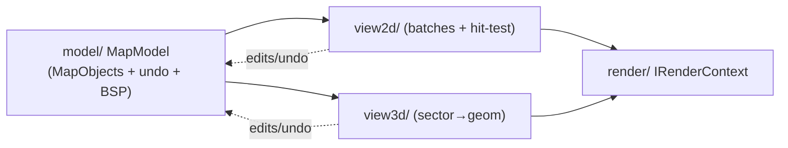
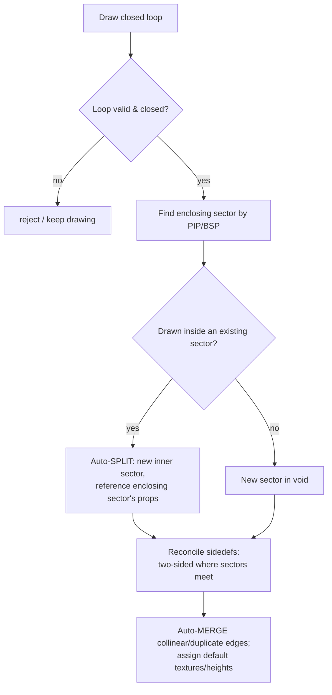

# Map editor — 2D & 3D visual mode

> How elads renders and edits Doom maps: the CPU-side geometry model driving GPU draws through the
> [render abstraction](02-render-abstraction.md), the 2D editing modes/tools (Eureka-style CPU
> hit-testing, UDB-style sector draw), and the 3D visual mode with a staged plan toward UDB parity.
> Read [data-model](03-data-model.md) for the `MapObject` graph this doc renders and mutates, and
> [render](02-render-abstraction.md) for the `IRenderContext` API every draw goes through.

---

## 1. Scope and module layout

Lives in `src/mapeditor/` (module 4 of 9; see [architecture](01-architecture.md)):

```
src/mapeditor/
  model/    MapModel: vertices/linedefs/sidedefs/sectors/things + undo,          (see 03-data-model.md)
            spatial index, subsector/BSP for point-in-sector, dirty tracking.
  view2d/   2D editor: camera (pan/zoom), grid, per-type render batches,
            CPU hit-testing, selection, edit tools, error checker.
  view3d/   3D visual mode: free-fly camera, sector→geometry builder,
            texture alignment tools, in-view interactions.
```

The **model** owns data and holds *no* GL/wx types. **view2d** and **view3d** are two independent
*presentations* of the same model: both build GPU buffers via the RAL and translate pointer input
into model edits routed through the shared undo system. Switching 2D↔3D (`Tab` in UDB) never
serializes — both views read the live in-memory model.



We reuse SLADE's map-editor *structure* (its `MapEditContext`, `MapRenderer2D/3D`, `ItemSelection`,
edit-mode state machine) but re-target every draw call from raw OpenGL onto the RAL, and grow the
feature set toward UDB. UDB is a **UX/feature reference only** — no C# is copied (see
[overview](00-overview.md), [licensing](10-licensing.md)).

---

## 2. The 2D editor

### 2.1 Coordinate spaces and camera

| Space | Units | Notes |
|-------|-------|-------|
| **Map** | Doom map units (integer vertex coords, `int16`/`int32` per format) | The model's native space. |
| **View** | map units, offset+scaled | `view = (map − pan) * zoom` |
| **Screen** | pixels | y flipped (map +y is up, screen +y is down). |

The camera is `{ pan.x, pan.y, zoom }`. `zoom` is pixels-per-map-unit (e.g. `0.25` = zoomed out,
`4.0` = zoomed in). One orthographic MVP goes into a per-frame UBO shared by every 2D batch; the
CPU keeps the same transform to map screen↔map for hit-testing (§2.4). Pan/zoom never touch the
model, so no redraw of GPU geometry is needed on navigation — only the UBO updates.

### 2.2 Render passes (painter's order)

view2d draws in strict back-to-front order so highlight/selection colors win:

```
1. Grid              (2.3)         line list, dim
2. Sector fills      (2.2.3)       cached triangle VBOs, only in Sectors mode / when enabled
3. Linedefs          (2.2.2)       line list, one/two-sided coloring
4. Vertices          (2.2.1)       point sprites
5. Things            (2.2.4)       sprites / icons + angle arrows
6. Highlight overlay                the object under the cursor
7. Selection overlay                the current selection set
8. Tool overlay      (2.5)         rubber-band draw line, snap indicator, splits
```

Passes 2–5 are the *scene*; 6–8 are *overlays* redrawn every frame (cheap, tiny vertex counts).
Scene batches are rebuilt only when the model's dirty flag for that type is set (§2.6). This keeps
the V3D GPU fed with large static VBOs and near-zero per-frame CPU work while idle — important on
the Pi's tile GPU (see [render](02-render-abstraction.md) §7 for the tile-GPU cost model).

#### 2.2.1 Vertices — point sprites

Each vertex is one point. We upload a `Points` VBO of `vec2` map positions and draw with
`Topology::Points`. `gl_PointSize` is set in the vertex shader to a **zoom-independent pixel size**
(vertices stay a constant on-screen dot regardless of zoom), with a larger size for the highlighted/
selected vertex. GLES 3.1 supports `gl_PointSize` and `gl_PointCoord`; the fragment shader draws a
round/square handle by discarding fragments outside a radius in `gl_PointCoord` space.

```glsl
// ILLUSTRATIVE — vertices.vert (#version 310 es)
layout(location = 0) in vec2 a_pos;         // map units
uniform mat4 u_mvp;                          // from per-frame UBO
uniform float u_pointPx;                     // constant pixel size
void main() {
    gl_Position  = u_mvp * vec4(a_pos, 0.0, 1.0);
    gl_PointSize = u_pointPx;                 // NOT scaled by zoom
}
```

#### 2.2.2 Linedefs — line lists with one/two-sided coloring

All linedefs go into one `Lines` VBO: two endpoints per line, each vertex carrying a small
`flags`/`color-index` attribute. Color is chosen by a lookup the shader indexes (or a vertex color
baked at batch build). The classic Doom-editor palette:

| Linedef class | Color (default) | Test |
|---------------|-----------------|------|
| One-sided (solid wall) | white/red | `back == null` |
| Two-sided (passable) | grey | `back != null` |
| Two-sided w/ height change or action | brighter / accent | special != 0, or floor/ceil differ |
| Special/tagged | yellow-ish accent | `special != 0` |

We keep the whole set in a single line list to minimize draw calls; per-line color variation is a
vertex attribute, not a state change. A short second `Lines` pass draws direction *nibs* (a tick on
the right side of each line showing its front) when that overlay is enabled — this mirrors UDB's
front-side indicator.

#### 2.2.3 Sector fills — earcut triangles in cached VBOs

Sectors are non-convex polygons (with holes) built from their bounding linedefs. To fill them we
triangulate with **`earcut.hpp`** (the header-only mapbox earcutter chosen project-wide; see
[data-model](03-data-model.md)) and cache the resulting index/vertex buffers per sector.

Triangulation pipeline:

```
sector → ordered boundary loops (outer + inner holes)
       → earcut(loops) → triangle index list
       → per-sector VBO/IBO (Static)  cached, keyed by sector id + geometry hash
```

Cache invalidation: when any vertex/linedef bounding the sector moves or the sector's loop set
changes, mark that sector's fill dirty and re-earcut only it. Fills are used mainly in **Sectors
mode** (flat-shaded by sector brightness, or a highlight tint), and optionally as a faint always-on
"floor" tint. Because fills are the heaviest 2D geometry, they are the batch most worth caching.

> **Loop extraction is the tricky part**, not earcut itself. Building correct outer/inner loops from
> a sector's unordered sidedef→linedef set (handling holes, self-touching sectors, and shared
> edges) reuses SLADE's sector-boundary tracing; see [data-model](03-data-model.md) for the
> sidedef→sector references that make this possible.

#### 2.2.4 Things — sprites / icons

Things draw as camera-facing quads (two triangles) textured with either the actual sprite (from the
resource archives via [graphics](06-graphics-texture-editor.md)) or a category icon when no sprite
is resolvable. Radius circles and a direction arrow (from the thing's angle) draw as line overlays.
Thing size on screen follows the thing's *map radius* scaled by zoom (unlike vertices, things have
real map extent), clamped to a minimum pixel size so they stay clickable when zoomed out.

### 2.3 Grid

A line list generated for the visible view rect at the current grid step. Two intensities:
minor lines at `gridSize`, major lines every N steps (and the x=0/y=0 axes brightest). The grid VBO
is rebuilt only when the visible rect or grid size changes. Grid never occludes: it draws first and
dim.

### 2.4 Hit-testing (CPU, Eureka approach)

Hit-testing is **entirely on the CPU** — we do *not* use GPU picking/readback (a readback stalls the
V3D tile pipeline; see [render](02-render-abstraction.md) §7). This follows the Eureka/SLADE model:
a spatial query in map space against the current edit mode's object type, seeded by the same
camera transform used for drawing so screen and hit geometry never diverge.

A **zoom-scaled pick radius** converts a fixed on-screen tolerance (e.g. 8–16 px) into map units:
`pickRadius = pixelTol / zoom`. All the tests below use it.

| Mode | Test | Detail |
|------|------|--------|
| **Vertices** | point-in-radius | nearest vertex within `pickRadius` of the cursor (map space). |
| **Linedefs** | perpendicular distance to segment | project cursor onto segment, clamp to `[0,1]`, distance ≤ `pickRadius`. Ties broken by nearest. |
| **Sectors** | point-in-polygon | locate the **subsector** containing the cursor via the map's BSP, then map subsector→sector; fallback to a crossing-number PIP over sector loops when no BSP is built. |
| **Things** | point-in-radius (thing radius) | cursor within the thing's radius (or icon pixel box). |

```cpp
// ILLUSTRATIVE — perpendicular distance, view2d/HitTest.cpp
float distToSeg(vec2 p, vec2 a, vec2 b) {
    vec2  ab = b - a; vec2 ap = p - a;
    float t  = clamp(dot(ap, ab) / dot(ab, ab), 0.f, 1.f);
    return length(p - (a + t * ab));            // map units; compare to pickRadius
}
```

To keep queries O(log n) / O(1)-ish on large maps, the model holds a **spatial index** (uniform grid
or bounding-box tree over vertices/lines; see [data-model](03-data-model.md)). Point-in-sector
prefers the **subsector** lookup: the same BSP that AJBSP/ZDBSP build for node data (see
[pipeline](07-build-test-pipeline.md)) gives exact, hole-correct sector containment in a tree
descent — far cheaper and more robust than PIP over every sector each frame.

### 2.5 Selection & highlight

- **Highlight** — the single object under the cursor in the current mode; recomputed on mouse-move,
  drawn in the highlight overlay pass. One object only.
- **Selection** — a *set* of object ids for the current mode. Click selects/replaces; `Shift`-click
  adds; `Ctrl`-click toggles; drag-box selects all of the mode's type intersecting the rubber-band
  rect; `Ctrl`+`A` selects all. Selection is per-mode; switching modes maps the selection where it
  makes sense (e.g. select sectors → switch to linedefs highlights their bounding lines), matching
  UDB's selection-carry behavior.

Both are pure overlays: they never rebuild scene batches, only push a handful of highlighted
primitives with an accent color and (for selection) a marching-ants or solid tint.

### 2.6 Batch dirtying / incremental rebuild

Each scene batch (verts, lines, fills, things) has a dirty flag driven by model change
notifications:

| Edit | Dirties |
|------|---------|
| Move/insert/delete vertex | verts, lines touching it, fills of adjacent sectors |
| Add/split/flip linedef | lines, fills of both sides |
| Change sector props/loop | that sector's fill only |
| Add/move/delete thing | things |

On frame build, only dirty batches re-upload (`BufferUsage::Dynamic` for frequently edited, `Static`
for fills). This bounds per-frame CPU to *what changed*, keeping interactive drag smooth on the Pi.

---

## 3. Editing modes

The 2D editor is a state machine over four object modes (UDB/SLADE hotkeys `V/L/S/T` or `1/2/3/4`):

```
Vertices ⇄ Linedefs ⇄ Sectors ⇄ Things
```

The mode selects which type hit-tests, highlights, selects, and which tools apply. A fifth implicit
context is **3D visual mode** (`Tab`), covered in §5. Mode changes are instant and preserve camera.

---

## 4. 2D tools

### 4.1 Draw / insert geometry

- **Insert vertex** (`Insert` in Vertices mode): drop a vertex at the snapped cursor; if on an
  existing linedef, **split** that line at the point (§4.4).
- **Draw lines** (Linedefs mode): click to place successive vertices; each new segment becomes a
  linedef. Chained until `Enter`/right-click. New vertices snap (§4.6); clicking an existing vertex
  or line reuses/splits it rather than duplicating geometry.

### 4.2 Drag with grid snap

Dragging selected vertices/lines/sectors/things moves them in map space; the drag delta is snapped
to the grid (§4.6) when snap is on. Dragging a vertex drags its incident linedefs; dragging a
linedef drags both endpoints; dragging a sector drags all its vertices as a rigid group. Live
preview redraws only the affected overlay; the model commits on mouse-up as one undo step.

### 4.3 Sector draw (the UDB workflow)

The headline UDB feature. The user draws a closed loop of lines; on close, elads:



Key behaviors, mirroring UDB:

- **Find enclosing sector** — point-in-polygon / subsector lookup on the drawn loop's interior
  decides whether the new geometry subdivides an existing sector (inherit its floor/ceil heights,
  textures, light) or creates a fresh sector in the void.
- **Auto-split** — drawing inside a sector splits it; shared edges become **two-sided** linedefs
  with correct front/back sidedef→sector references.
- **Auto-merge** — new lines that overlap or are collinear with existing ones merge instead of
  duplicating; zero-length results are dropped.
- **Sidedef reconciliation** — every edge that now separates two sectors gets both sidedefs; edges
  facing the void stay one-sided.

### 4.4 Split / join linedefs

- **Split** — insert a vertex mid-line; the line becomes two, sidedefs duplicated, texture offsets
  recomputed so alignment is visually preserved.
- **Join / merge** — collapse a vertex shared by two collinear lines back into one line; drop
  redundant vertices.

### 4.5 Flip, curve, and other geometry ops

- **Flip linedef** — swap front/back sidedefs (and reverse start/end vertex), reversing the line's
  facing. Used to correct inside-out sectors.
- **Flip sector** — flip all bounding lines consistently.
- **Curve / arc** (UDB "Curve Linedefs") — replace a line/segment with an N-segment circular arc
  by vertices distributed along a computed radius; the number of segments and bulge are
  interactive parameters.
- **Bridge / connect, drag-to-merge, and align** round out the set as later additions.

### 4.6 Grid & snap configuration

| Setting | Behavior |
|---------|----------|
| **Grid size** | power-of-two map units (…8,16,32,64…). Keyboard `[` / `]` halve/double, mouse-wheel+mod. |
| **Snap to grid** | round the cursor/drag delta to the nearest grid multiple (toggle, default on). |
| **Snap to vertices/lines** | prefer an existing vertex or nearest point on a line within pick radius over the raw grid point — lets geometry connect exactly. |
| **Grid rotation / origin** | optional rotated/offset grid (UDB dynamic grid) for angled work. |

Snap resolution order when placing a point: **existing vertex → point-on-line → grid → free**.

### 4.7 Error checking (map analysis)

A checker pass (UDB "Map Analysis Mode" / SLADE checks) scans the model and reports fixable issues.
Each result carries a locate-and-select action so double-clicking jumps the 2D view to it.

| Check | Detection | Typical fix |
|-------|-----------|-------------|
| **Unclosed sector** | a sector loop that doesn't close, or an edge with a missing opposite sidedef | flag lines; offer to add sidedef / close |
| **Overlapping lines** | two linedefs sharing the same two endpoints or overlapping collinearly | merge / delete duplicate |
| **Zero-length lines** | start vertex == end vertex | delete line |
| **Missing textures** | one-sided line with no middle texture, or two-sided upper/lower exposed by a height change but untextured | assign default / `-` handling |
| **Unreachable / unclosed geometry** | vertices/lines/sectors not referenced by any sector, or void-touching two-sided lines | delete stray, or convert |
| **Overlapping vertices** | two vertices within epsilon | merge |
| **Stuck / out-of-bounds things** | thing outside any sector or inside a wall | relocate flag |

The checker reuses SLADE's `MapChecks` family where present, extended toward UDB's error set. It is
non-destructive: it only *reports*; fixes are explicit user actions folded into undo.

---

## 5. 3D visual mode

`Tab` enters a first-person view of the same live model — UDB's "Visual Mode". Nothing is baked to
disk; geometry is synthesized on the fly from the sector/linedef model.

### 5.1 Free-fly camera

A free 6-DoF fly camera (not gravity-bound by default): WASD + mouse-look, `Q/E` or `Space/Ctrl`
for up/down, shift to accelerate. A perspective projection MVP goes into the 3D per-frame UBO. The
camera position also drives *which* sector the user is "in" for context (gravity/align-to-floor is
an optional mode, matching UDB's toggle).

### 5.2 Generating renderable geometry from sectors

The core of visual mode: turn the 2D sector graph into 3D triangles. Built lazily/cached per sector,
invalidated on the same dirty signals as the 2D fills (§2.6).

**Floors & ceilings (flats):** each sector's floor and ceiling are horizontal polygons at
`floorHeight` / `ceilingHeight`. Reuse the **same earcut triangulation** as the 2D sector fill
(§2.2.3) — the (x,y) loops are identical; only z and the flat texture differ. Floor triangles face
up, ceiling triangles face down (reversed winding).

**Walls (from linedef + sidedef + neighboring sector heights):** each linedef with a sidedef
produces up to three vertical quads, exactly Doom's wall model:

```
        neighbor ceil ─┐
   this ceil ───┐      │  UPPER quad  (this.ceil → neighbor.ceil, when this.ceil > neighbor.ceil)
                │██████│
                │      ├─ MIDDLE quad (one-sided: full floor→ceil;
                │      │              two-sided: the "opening" middle texture, often none)
                │██████│
   this floor ──┘      │  LOWER quad  (neighbor.floor → this.floor, when neighbor.floor > this.floor)
        neighbor floor ┘
```

| Quad | One-sided line | Two-sided line |
|------|----------------|----------------|
| **Upper** | — | when front.ceil > back.ceil: fill the gap with the sidedef's *upper* texture |
| **Middle** | full floor→ceil, sidedef *middle* texture | the see-through opening; middle texture only if set (e.g. grates/rails) |
| **Lower** | — | when back.floor > front.floor: fill with sidedef's *lower* texture |

Each quad's vertices carry UVs computed from the linedef length, quad height, and the sidedef's
`x/yOffset` (see alignment, §5.4). Winding is chosen so the textured face points into the sector the
sidedef belongs to.

**Sky handling:** ceilings (or floors) using the sky flat (`F_SKY1`) are **not** drawn as normal
flats — they are rendered as a sky and the sky mask means upper quads adjacent to a sky ceiling are
also skipped (the classic Doom "sky window" behavior). We render sky as a screen-filling
background/dome sampled from the sky texture and stencil-mask real geometry over it, matching
GZDoom's approach.

### 5.3 Texture application

Textures/flats resolve through the resource archives via [graphics](06-graphics-texture-editor.md)
(TEXTUREx/TEXTURES composition, patches, PNG). Each wall quad and flat samples one texture; on the
Pi we bind textures individually or pack into a `Tex2DArray`/atlas to cut state changes (see
[render](02-render-abstraction.md) §7). Missing/`-` textures show a distinct "missing" checker so
errors are visible in-view (feeds §4.7).

### 5.4 Texture alignment tools

Alignment is the reason visual mode exists for texturing. Per surface we track offsets and flags:

| Control | Effect |
|---------|--------|
| **X/Y offset** | shift `sidedef.xOffset` / `yOffset` (walls) or sector flat offset (UDB flats), live. |
| **Auto-align X (unpeg)** | propagate alignment across connected same-texture walls (UDB `A`), computing offsets from cumulative linedef lengths. |
| **Peg upper/lower** | `Lower/Upper Unpegged` linedef flags control which end the texture anchors to across height changes. |
| **Scale / rotation** | where the format supports it (UDB/ZDoom sidedef scale, flat rotation). |
| **Fit / reset** | fit texture to surface, or zero offsets. |

These edit the model's sidedef/sector fields and re-UV only the affected quads.

### 5.5 Light & fog from sector props

- **Sector light** — `sector.lightlevel` (0–255) becomes a per-surface brightness multiplier applied
  in the fragment shader (uniform per draw or a vertex attribute). Relative light on upper/lower and
  the classic fake-contrast (E-W brighter, N-S dimmer) can be layered in later.
- **Fog** — distance fog computed in the shader from camera→fragment distance, with color/density
  from sector properties (ZDoom `fadecolor`/`fogdensity`) or a global default. Fog is a **shader
  feature from v1** (cheap on the tile GPU) rather than a fixed-function state.

```glsl
// ILLUSTRATIVE — wall.frag (#version 310 es), v1 lighting
uniform sampler2D u_tex;
uniform float u_sectorLight;     // 0..1 from sector.lightlevel
uniform vec3  u_fogColor;
uniform float u_fogDensity;
in  vec2  v_uv;
in  float v_dist;                // camera distance, map units
out vec4  o_color;
void main() {
    vec4 t = texture(u_tex, v_uv);
    vec3 c = t.rgb * u_sectorLight;
    float f = clamp(exp(-u_fogDensity * v_dist), 0.0, 1.0);
    o_color = vec4(mix(u_fogColor, c, f), t.a);
}
```

---

## 6. Staging plan toward UDB parity (3D visual mode)

Visual mode ships incrementally. Each stage is independently useful and stays within the RAL's
GLES-3.1 common denominator (see [render](02-render-abstraction.md) §4).

| Stage | Feature | How | Notes / cost |
|-------|---------|-----|--------------|
| **v1** | Textured walls/flats + **sector light** + **shader fog** | §5.2–5.5; one texture per surface, brightness+fog in FS | The baseline "walk your map". |
| **later** | **Slopes** | plane equation per sloped surface evaluated in the **vertex shader** (z from plane at (x,y)); flats become sloped tri-fans | No new geometry topology; a `vec4` plane per surface in a UBO. |
| **later** | **Stacked 3D floors** | synthesize extra slabs (floor+ceiling+side quads) from the control-sector model (ZDoom 3D floors / GZDoom `Sector_Set3DFloor`) | Pure geometry synthesis; reuses the wall/flat builder. |
| **later** | **Dynamic lights** | a **capped forward list** of nearby lights in a **UBO** (std140), summed per fragment | Cap the count (e.g. ≤ 16–32) to bound V3D fragment cost; forward, not deferred. |
| **later** | **Sprites + MODELDEF models** | things drawn as billboards (camera-facing quads, §2.2.4 in 3D) and, where a `MODELDEF` exists, as meshes | Model loading via graphics/pipeline; keep vertex counts modest. |
| **off by default** | **Shadowmaps** | disabled on the Pi | **V3D fill-rate**: extra full-scene depth passes are too expensive on the tile GPU; opt-in only on desktop. |

Design intent: **do the cheap, high-value things in shaders** (slopes, fog, light, capped dynamic
lights) and **synthesize geometry** for structural features (3D floors), avoiding anything that
multiplies fill-rate (shadowmaps) on V3D. Everything above is authored once against the RAL; the
desktop-GL fallback gets the same features via the lowering rules in [render](02-render-abstraction.md).

---

## 7. In-visual-mode interactions

Direct editing while walking the map (UDB visual-mode edits), all folded into the shared undo:

| Action | Input (UDB-style) | Effect |
|--------|-------------------|--------|
| **Paint texture** | select surface, apply from browser / copy-paste texture | set that wall/flat's texture; copy/paste across surfaces. |
| **Align textures** | drag / `A` auto-align / arrow-key nudge offsets | §5.4; live UV update. |
| **Raise / lower** | mouse-wheel or `+`/`-` on a highlighted floor/ceiling | change `floorHeight`/`ceilingHeight` in grid steps; walls rebuild. |
| **Place / move things** | insert thing at aimed floor point; drag to reposition; scroll to set z | edits thing list; sprite updates. |
| **Pick (eyedropper)** | copy texture/offsets from one surface, paste to others | UDB copy/paste-properties. |

Highlighting in 3D is a CPU ray pick: cast the camera ray, intersect against the synthesized quads/
flats (or use the BSP to find the aimed surface), and highlight the hit surface — the 3D analogue of
§2.4. No GPU readback.

---

## 8. Specific UDB UX behaviours to mirror

A concrete checklist of interactions elads deliberately reproduces (feature parity, not code):

- **`Tab` toggles 2D ⇄ 3D** on the same live map, preserving position/context.
- **Sector draw with auto-split / auto-merge / find-enclosing-sector** (§4.3) — the defining UDB
  workflow.
- **Selection carries across modes** (sectors ↔ their lines ↔ their vertices).
- **Grid: `[` / `]` resize, snap toggle, snap-to-geometry, dynamic/rotated grid.**
- **Visual-mode auto-align (`A`) with upper/lower unpegging** and arrow-key offset nudging.
- **Copy/paste properties** (textures, offsets, heights, flags) between surfaces/sectors/things.
- **Raise/lower floors & ceilings by mouse-wheel** in visual mode, in grid increments.
- **Highlight-follows-cursor** with a single highlighted object and a separate multi-selection set.
- **Map analysis / error-check mode** with jump-to-error and one-click fixes (§4.7).
- **Undo/redo everything**, including geometry and visual-mode edits, as coherent steps.
- **Insert-vertex-splits-line** and **draw-onto-existing-geometry reuses it** rather than duplicating.
- **Info panels** reflecting the highlighted object's live properties (edit in place).
- **Things show real sprites** (resolved from the archive) with angle arrows and radius.

Formats and the exact fields these edits touch (linedef flags, sidedef offsets, ZDoom/UDMF
extensions) are in [formats-reference](08-formats-reference.md); the object graph and undo model are
in [data-model](03-data-model.md).

---

## 9. Cross-references

- [02-render-abstraction.md](02-render-abstraction.md) — every draw here goes through
  `IRenderContext` (batches, UBOs, `Topology::Points/Lines/Triangles`, textures); the tile-GPU cost
  model (§7 there) justifies the batching/caching and the no-GPU-readback hit-testing here.
- [03-data-model.md](03-data-model.md) — the `MapObject` graph (vertices/linedefs/sidedefs/sectors/
  things), spatial index, BSP/subsector for point-in-sector, dirty tracking, and undo that this
  editor renders and mutates.
- [06-graphics-texture-editor.md](06-graphics-texture-editor.md) — texture/flat/sprite resolution.
- [07-build-test-pipeline.md](07-build-test-pipeline.md) — AJBSP/ZDBSP node build (BSP source),
  and GZDoom playtest.
- [08-formats-reference.md](08-formats-reference.md) — Doom/Hexen/UDMF fields the tools edit.
- [01-architecture.md](01-architecture.md), [00-overview.md](00-overview.md) — module placement and
  the "UDB is a reference, not a codebase" rule.
```