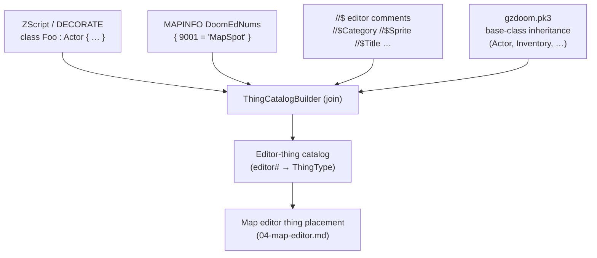

# Text & script editor

The Scintilla-based code editor for GZDoom text lumps, the data-driven language
definitions that drive highlighting/calltips/completion, the Thing/actor browser that
joins those lumps into an editor catalog, and the Lua/sol2 scripting engine. All of this
lives in the `texteditor` and `scripting` modules and is reused ~intact from SLADE3 (see
[architecture](01-architecture.md)). Byte-level lump layouts are in
[formats-reference](08-formats-reference.md); GZDoom validation orchestration is in
[build-test-pipeline](07-build-test-pipeline.md).

---

## 1. Scope and layering

```
res/config/languages/*.txt        ← DATA: keywords, styles, comment/string rules
        │  parsed once at startup
        ▼
   TextLanguage  (one per language)      texteditor/
        │  drives
        ▼
   Lexer (SCLEX_CONTAINER)  ──►  wxStyledTextCtrl (Scintilla 5 + Lexilla)
        │                              │  highlight · calltip · autocomplete
        │                              ▼
        │                        TextEditorCtrl panel  (wxAUI page)
        │
   ZScript/DECORATE + MAPINFO + //$ comments + gzdoom.pk3
        │  joined by ThingCatalogBuilder
        ▼
   Editor-thing catalog  ──►  consumed by map editor thing placement
                                (see 04-map-editor.md)

   scripting/ :  Lua 5.4 + sol2  ──►  ScriptManager  ──►  sandboxed sol::environment
                                          │  domains: Archive/MapEditor/Game/Graphics/UI
                                          ▼  console · plugins · batch ops
```

Design invariants:

- **Language rules are data, not code.** New GZDoom keywords land by editing a text file in
  `res/config/languages/` (see that dir's `README.md`), never by recompiling. This is
  SLADE's proven pattern (`src/TextEditor/TextLanguage.cpp`, res files under
  `res/text_languages/` upstream).
- **The editor never *interprets* the language.** Scintilla + our `Lexer` only *tokenize*
  for display and completion. Authoritative semantic validation is delegated out-of-process
  to GZDoom (§7). We do not ship a bespoke ZScript parser.
- **The Thing catalog is a read model.** It is derived from lumps + base game data and
  handed to the map editor; the text editor owns the *derivation*, the map editor owns the
  *consumption*.

---

## 2. The Scintilla editor (reused from SLADE)

We reuse SLADE's `TextEditorCtrl`, which wraps Scintilla via wxWidgets' `wxStyledTextCtrl`
(STC). Scintilla 5 + Lexilla are the vendored editing engine (see stack in
[overview](00-overview.md)).

| Concern | Mechanism |
|---|---|
| Widget | `wxStyledTextCtrl` (Scintilla 5) hosted in a wxAUI page |
| Lexing | `SCLEX_CONTAINER` — Scintilla defers styling to us, not a built-in Lexilla lexer |
| Styling driver | our `Lexer` reacts to `SCN_STYLENEEDED` (`wxEVT_STC_STYLENEEDED`) |
| Folding | container fold-level flags set during the style pass (blocks by `{ }`) |
| Margins | line numbers, fold margin, change/marker margin |
| Calltips | Scintilla `CallTipShow` fed from `TextLanguage` function data |
| Autocomplete | Scintilla `AutoCompShow` fed from keyword/type/property lists |
| Brace match, indent guides, whitespace | native Scintilla features, configured per style |

### Why a container lexer (SCLEX_CONTAINER)

The GZDoom language family is context-sensitive in ways stock Lexilla lexers don't cover:
`//$` editor comments are semantically meaningful, block keywords open folds, DECORATE and
ZScript share syntax but differ in reserved words, and keyword sets must be swappable at
runtime from data. A container lexer means **we own the token→style mapping in C++**, reading
its keyword/rule tables from the parsed `TextLanguage`. Scintilla just calls us back over the
dirty byte range and we emit style bytes.

Illustrative shape (intent, not an authoritative SLADE signature):

```cpp
// texteditor/Lexer.h — illustrative
class Lexer {
public:
    void   setLanguage(TextLanguage* lang);
    // called on SCN_STYLENEEDED for [start, end)
    void   doStyling(wxStyledTextCtrl* stc, int start, int end);
    // feed the autocomplete/calltip UI
    std::string autocompletionList(std::string_view root) const;
    bool   isFunction(std::string_view word) const;
private:
    enum class State { Default, Comment, String, Char, Number, Word, Whitespace };
    // keyword hash sets sourced from TextLanguage: keywords/types/constants/properties/functions
};
```

The lexer is a small hand-rolled state machine (whitespace / word / number / string / char /
line-comment / block-comment). On a completed word it classifies against the active
`TextLanguage`'s hash sets and emits the matching style id; unknown identifiers get the
default style. This mirrors SLADE's `Lexer` (`src/TextEditor/Lexer.cpp`).

---

## 3. Data-driven language definitions

### 3.1 File format

One file per language under `res/config/languages/`, in SLADE's `TextLanguage` block syntax
(the same recursive `key = value;` / `name { … }` grammar SLADE's `Parser`/`Tokenizer`
reads). Each file declares: identity + inheritance, lexer rules, and named word lists that
become styles, calltips, and completion entries.

Illustrative `zscript.txt` (shape follows SLADE upstream; keyword contents abbreviated):

```
zscript : decorate            // inherit DECORATE's lists, then extend
{
    name = "ZScript";
    case_sensitive = false;

    // lexer rules
    comment_begin = "/*";  comment_end = "*/";
    line_comment  = "//";
    block_begin   = "{";   block_end = "}";
    preprocessor  = "#";                    // #include, #region
    doc_comment   = "//$";                  // editor keys (see §5)

    // word lists → styles + completion
    keywords   = { class extend struct enum const static native abstract
                   if else for while do switch case return break continue
                   play ui clearscope virtualscope virtual override … }
    types      = { int uint double bool string name sound color vector2
                   vector3 State Actor Object … }
    constants  = { true false null MAXINT MININT M_PI … }
    properties = { Health Radius Height Speed Damage DamageType … }  // actor props
    functions
    {
        A_Jump { args = "chance, label, …"; return = "state"; }
        A_SpawnItemEx { args = "class, xoff, yoff, zoff, xvel, …"; }
        …
    }
}
```

Key fields and their runtime effect:

| Field | Consumed by | Effect |
|---|---|---|
| `case_sensitive` | Lexer word lookup | ACS is case-sensitive; ZScript/DECORATE are not |
| `comment_begin/end`, `line_comment` | Lexer | comment styling + fold |
| `block_begin/end` | Lexer/folding | `{`/`}` fold points |
| `keywords` / `types` / `constants` / `properties` | Lexer + autocomplete | distinct styles + completion words |
| `functions { … args, return }` | calltips + autocomplete | `CallTipShow` text on `(` |
| `: parent` | loader | copy parent lists first, then extend (DECORATE→ZScript) |

Styles (colors, bold/italic) are resolved against the editor's **color theme**, keyed by the
style class (keyword/type/constant/comment/string/…), not baked into the language file. One
theme restyles every language.

### 3.2 Why data, not code

- **Track GZDoom without a rebuild.** New action functions, flags, and reserved words appear
  every GZDoom release. A packager (or a user) drops updated word lists in and reloads.
- **User-extensible.** A mod project can ship its own supplemental keyword file; power users
  fix a missing calltip without touching C++.
- **One engine, many languages.** ~15 GZDoom lumps share the same `TextLanguage`/`Lexer`
  machinery; differences are entirely in data.

### 3.3 Supported languages (Phase 1)

| File (language) | Lump(s) | Notes |
|---|---|---|
| `zscript` | ZSCRIPT | inherits `decorate`; the large one, versioned to GZDoom |
| `decorate` | DECORATE | legacy actor DSL; case-insensitive |
| `acs` | SCRIPTS / behavior source | C-like, **case-sensitive**; compiled by `acc` (see [pipeline](07-build-test-pipeline.md)) |
| `mapinfo` | MAPINFO / ZMAPINFO | maps, episodes, **DoomEdNums**, GameInfo (§5) |
| `gldefs` | GLDEFS | dynamic lights, glow, skybox, brightmaps |
| `sndinfo` | SNDINFO | logical sound → lump mappings, random sounds |
| `animdefs` | ANIMDEFS | flat/texture/warp animations, cameras |
| `textures` | TEXTURES | composite/HiRes texture defs (also edited in [graphics](06-graphics-texture-editor.md)) |
| `language` | LANGUAGE | localization string tables |
| `cvarinfo` | CVARINFO | user/server cvar declarations |
| `modeldef` | MODELDEF | 3D model → actor/frame bindings |
| `keyconf` | KEYCONF | key bindings, weapon slots |
| `terrain` | TERRAIN | splash/footstep terrain by flat |
| `lockdefs` | LOCKDEFS | key/lock definitions, messages |
| `decaldef` | DECALDEF | decal groups, animators |
| `lua` | *(elads plugin/console scripts)* | Lua 5.4 for automation (§6); a standard Lua lexer, **not** a GZDoom lump — highlights/completes elads' own scripts |

The GZDoom-lump languages are referenced off the GZDoom wiki lump specs (zdoom.org/wiki);
`lua` is the odd one out — it highlights elads' own plugin/console scripts rather than a
resource lump. ZScript and DECORATE are
the semantically rich pair the Thing browser (§5) and validator (§7) care about; the rest are
mainly syntax highlighting + completion targets.

---

## 4. Highlighting, calltips, and completion

All three read from the same `TextLanguage` data — no separate index.

- **Highlighting.** During `doStyling`, each classified word gets the style id for its list
  (keyword/type/constant/property/function). Comments/strings/numbers/preprocessor are styled
  from the lexer state machine. Fold levels are emitted at `block_begin`/`block_end`.
- **Calltips.** On `(` after a known function name, `TextLanguage::getFunction(name)` returns
  the `args`/`return` metadata and Scintilla shows a calltip; multiple overloads page with the
  up/down arrows Scintilla provides.
- **Word completion.** On typing (or Ctrl-Space), the lexer builds a space-separated candidate
  string from all active word lists (plus identifiers already seen in the buffer) filtered by
  the current root, and calls `AutoCompShow`. Because ACS is case-sensitive and the actor DSLs
  are not, matching honors the language's `case_sensitive` flag.

This is deliberately **lexical, not semantic** — it does not resolve types or scope. That is a
known limitation, addressed by deferring a real semantic layer (§8) and by leaning on GZDoom
for correctness (§7).

---

## 5. Thing / actor browser

The map editor needs a catalog of placeable *things*: for each editor number, a name,
category, sprite/icon, angle semantics, and flags. GZDoom does not ship this as a table — it
is **implied** by the union of several lumps plus the base game. We build it the way Ultimate
Doom Builder does (UDB is our UX/behavior reference only — no C# is copied; see
[overview](00-overview.md)).

### 5.1 Inputs joined



| Source | Contributes |
|---|---|
| **ZScript/DECORATE class defs** | the actor class graph, `DoomEdNum n`, `Radius`/`Height`, sprite/`States`, default flags |
| **MAPINFO `DoomEdNums`** | editor-number → class overrides/additions independent of the class default |
| **`//$` editor comments** | editor-only metadata attached above/inside a class: `//$Title`, `//$Category`, `//$Sprite`, `//$Color`, `//$Angled`/`//$NotAngled`, `//$Arg0`… (UDB convention) |
| **gzdoom.pk3 base classes** | inherited defaults for editor-number-less bases; resolves properties up the inheritance chain |

### 5.2 Join algorithm (intent)

1. **Parse actor classes** from all ZScript + DECORATE lumps into a class table (name,
   parent, properties, `DoomEdNum`, states/sprite, flags). Parsing here is *lexical + block
   structural* — the same tolerance the lexer uses — not a full compile; GZDoom is the real
   checker (§7).
2. **Resolve inheritance** against `gzdoom.pk3` base classes so a subclass inherits
   `Radius`/`Height`/sprite/flags it doesn't override. `gzdoom.pk3` is loaded as a base
   resource archive (see [data-model](03-data-model.md)).
3. **Apply MAPINFO `DoomEdNums`**: any `editor# = ClassName` line binds/overrides an editor
   number to a class, overriding a class's own `DoomEdNum`.
4. **Overlay `//$` editor keys**: category, display title, browser sprite, tint color, angle
   behavior, argument labels — these affect the *editor UI only*, never the game.
5. **Emit `ThingType` records** keyed by editor number; group by `//$Category` (falling back
   to MAPINFO/game-config categories) for the browser tree.

Illustrative record (shape, not a fixed SLADE struct):

```cpp
// intent
struct ThingType {
    int          ednum;        // Doom editor number
    std::string  className;    // resolved actor class
    std::string  title;        // //$Title or class name
    std::string  category;     // //$Category → browser tree
    double       radius, height;
    SpriteRef    sprite;       // for browser + 2D/3D preview
    bool         angled = true;// //$NotAngled ⇒ false
    ArgSpec      args[5];      // //$ArgN labels for Hexen/UDMF
    uint32_t     flags;        // default actor flags
};
```

### 5.3 How the map editor consumes it

The catalog is exposed to `mapeditor/` as the placeable-thing palette. The Thing browser
(searchable, category tree, sprite preview) picks a `ThingType`; placement writes the
`ednum` into a `MapThing`, and the 2D/3D views render the `sprite` at `radius`/`height`.
Consumption details, angle/arg editing, and the 3D preview are in
[map-editor](04-map-editor.md). Rebuilding is incremental: editing a ZScript/DECORATE/MAPINFO
lump invalidates and rejoins the catalog so newly-defined actors appear without a restart.

---

## 6. Lua scripting API (sol2)

We reuse SLADE's Lua 5.4 + sol2 engine (`src/Scripting/`). This is elads' **primary plugin
surface** — automation, custom actions, UI panels, and batch asset ops — chosen over a native
plugin ABI, which is brittle to ship and version on aarch64 (see
[architecture](01-architecture.md)).

### 6.1 Domain-split bindings

sol2 usertypes/functions are registered under one global table, split per domain so a script
pulls in only what it needs and the surface stays reviewable:

| Namespace | Exposes | Example ops |
|---|---|---|
| `Archive` | VFS/archive core ([data-model](03-data-model.md)) | open/save archives, add/rename/remove entries, read/write entry bytes |
| `MapEditor` | current map model + selection | query/edit vertices/lines/sides/sectors/things, selection, undo groups |
| `Game` | game config + Thing catalog (§5) | look up `ThingType`, editor numbers, categories |
| `Graphics` | SIFormat images / palettes / TEXTUREx ([graphics](06-graphics-texture-editor.md)) | convert/export images, edit composite textures, palette ops |
| `UI` | app UI + log | message boxes, progress, prompts, `logMessage`, add menu/toolbar actions & panels |

Illustrative bindings (intent — do not treat as exact SLADE signatures):

```cpp
// scripting/LuaBindings.cpp — illustrative
sol::table archive = lua["Archive"];
archive.set_function("open", &ArchiveManager::openArchive);
archive.new_usertype<ArchiveEntry>("Entry",
    "name", sol::property(&ArchiveEntry::name, &ArchiveEntry::setName),
    "data", sol::property(&ArchiveEntry::dataAsString, &ArchiveEntry::importString));

sol::table mapeditor = lua["MapEditor"];
mapeditor.set_function("selectedThings", &MapEditContext::selectedThings);
```

### 6.2 ScriptManager, sandbox, console, plugin lifecycle

```
ScriptManager
  ├─ owns the sol::state (Lua 5.4)
  ├─ registers all domain bindings once
  ├─ per script: fresh sandboxed sol::environment
  │     · whitelisted stdlib (no os.execute/io by default)
  │     · domain tables injected as globals
  ├─ Console  ── REPL over the same state (interactive automation, debugging)
  └─ Plugins  ── discovered .lua files run once at load:
        load → register (actions / UI panels / batch ops) → callbacks live until unload
```

- **ScriptManager** (`src/Scripting/ScriptManager.cpp`) owns the single `sol::state`, registers
  bindings, and runs scripts. Scripts of different kinds (editor scripts, archive scripts, map
  scripts, custom actions) are catalogued and surfaced in menus.
- **Sandboxed `sol::environment`.** Each script runs in its own environment with a whitelisted
  standard library — dangerous surfaces (`os.execute`, raw `io`, `package`/`require` into
  native libs) are withheld by default so a shared plugin can't trivially escape. Domain tables
  are injected as environment globals.
- **Console.** A REPL bound to the same state for interactive automation and debugging — the
  fastest path to poke at the current archive/map.
- **Plugin lifecycle.** On startup, `*.lua` plugins are discovered and executed once; during
  that run they **register** contributions — custom actions (menu/toolbar/keybind), UI panels
  (wxAUI pages), and batch operations. Registered callbacks persist for the session and are
  torn down on unload/reload. Batch ops (e.g. "convert every flat to PNG", "renumber things")
  are the highest-value pattern on the Pi where they replace manual repetition.

---

## 7. Validation via out-of-process GZDoom

There is **no bespoke ZScript/DECORATE semantic checker in elads** and none is planned. Our
lexer is intentionally shallow (§4). For correctness we shell out to a real GZDoom build as
the **authoritative validator**:

- GZDoom parses the full ZScript/DECORATE tree at load and reports errors/warnings; we invoke
  it to parse the project and capture its diagnostics from stdout/stderr (`parse -stdout`
  style; exact invocation and log scraping are specified in
  [build-test-pipeline](07-build-test-pipeline.md)).
- **Caveat (from shared facts):** GZDoom has no headless compile-only mode — it needs a live
  GL context to reach the point where it has parsed scripts. On the Pi that means the **GLES
  backend** (`+vid_preferbackend 3`, GLES mainlined ~4.8). The pipeline doc owns how we spin a
  minimal/offscreen context (EGL/GBM) so validation runs in CI and on desktop. See
  [pipeline](07-build-test-pipeline.md) and [rpi5-target](09-rpi5-target.md).
- Diagnostics are parsed back to `file:line` and surfaced as editor annotations/margin markers
  in the STC panel. The editor provides the UX; GZDoom provides the truth.

This keeps us honest against whatever GZDoom version the user targets, at the cost of a
run-to-validate loop rather than as-you-type semantics.

---

## 8. Deferred: semantic layer (tree-sitter / LSP)

As of the shared facts (cutoff Jan 2026) there is **no mature, reusable ZScript LSP or
tree-sitter grammar** we can adopt. A real semantic layer — cross-file symbol resolution,
type-aware completion, go-to-definition, live diagnostics without a GZDoom round-trip — is
therefore **deferred to a later phase** (see [roadmap](../roadmap.md)). When revisited, the
likely shape is a tree-sitter grammar feeding an in-process index, or a thin LSP server; both
would *augment*, not replace, the data-driven lexer and the GZDoom validator. Until then:

| Capability | Phase 1 source |
|---|---|
| Syntax highlighting | data-driven `Lexer` (§2–4) |
| Keyword/type/function completion | `TextLanguage` word lists (§4) |
| Calltips | `TextLanguage` function data (§4) |
| Semantic correctness | out-of-process GZDoom (§7) |
| Cross-file symbols / type-aware IntelliSense | *deferred* (§8) |

---

## 9. Implementation notes & reuse map

| Piece | Upstream (SLADE) | elads status |
|---|---|---|
| `wxStyledTextCtrl` editor panel | `src/TextEditor/UI/TextEditorCtrl` | reuse |
| Container `Lexer` | `src/TextEditor/Lexer.cpp` | reuse; extend word lists as data |
| `TextLanguage` + parser | `src/TextEditor/TextLanguage.cpp` | reuse; files in `res/config/languages/` |
| Language data files | `res/text_languages/*.txt` (upstream) | fork → `res/config/languages/`, GZDoom-tracked |
| Lua/sol2 engine + `ScriptManager` | `src/Scripting/` | reuse |
| Thing catalog join | (UDB-modeled; SLADE game configs) | new `ThingCatalogBuilder` in `texteditor`/`archive` seam |

Related docs: [architecture](01-architecture.md) · [data-model](03-data-model.md) ·
[map-editor](04-map-editor.md) (thing browser consumer) ·
[graphics-texture-editor](06-graphics-texture-editor.md) (shares TEXTURES) ·
[build-test-pipeline](07-build-test-pipeline.md) (GZDoom validation) ·
[formats-reference](08-formats-reference.md) (lump byte layouts) · [roadmap](../roadmap.md)
(deferred semantic layer).
