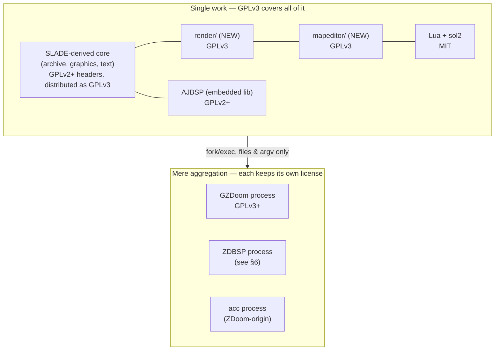

# Licensing & reuse policy

> Why elads ships as **GPLv3**, what that means for every dependency we link, bundle, or shell out to,
> and the per-file header rules contributors must follow. Engineering guidance for implementers — **not
> legal advice**. When a real question of copyright arises, consult a lawyer, not this document.

---

## 1. The decision in one line

**elads is licensed GPLv3-or-later.** The whole application binary — SLADE-derived code plus our new
[`render`](02-render-abstraction.md) and [`mapeditor`](04-map-editor.md) subsystems — is distributed
under the terms in [`../../LICENSE`](../../LICENSE) (GNU GPL v3, 29 June 2007).

Everything else in this doc explains *why that is lawful* and *how to keep it lawful* as the codebase grows.

---

## 2. Why GPLv3 (and why we even have a choice)

elads is a **derivative work of SLADE3**. SLADE's license therefore constrains ours: we cannot pick a
license more permissive than what SLADE's copyleft allows. The question is only *which* GPL version the
combined work lands on.

The pivotal fact:

> **SLADE is GPLv2-OR-LATER, not GPLv2-only.** Every SLADE source file carries the FSF "version 2 …
> or (at your option) any later version" grant in its header.

That "or later" clause is a standing offer from SLADE's authors: any recipient may elect to treat the
code under **GPLv2, GPLv3, or any future GPL**. We exercise that election and relicense the combined
work forward to **GPLv3**. This is the ordinary, intended mechanism of the "or later" clause — no
permission email required.

```
SLADE per-file header (paraphrased — see any src/*.cpp in the SLADE repo):

    This program is free software; you can redistribute it and/or modify
    it under the terms of the GNU General Public License as published by
    the Free Software Foundation; either version 2 of the License, or
    (at your option) any later version.        <-- THIS is the hinge
```

### Why forward to GPLv3 and not stay at GPLv2?

| Reason | Detail |
|---|---|
| GPLv3-only deps become linkable | Notably **GZDoom is GPLv3+**. We only *shell out* to it (§6), so this is belt-and-suspenders, but it removes any future ambiguity if we ever link GPLv3 code. |
| Patent + anti-tivoization clauses | GPLv3's explicit patent grant and installation-info terms are the modern default for new copyleft projects. |
| Compatibility surface | GPLv3 is one-way compatible with more permissive licenses (Apache-2.0, etc.) that GPLv2 is *not*; keeps future dependency choices open. |
| It is the terminal, forward-most version we can reach from "v2 or later." | GPLv2-only code could *not* have been combined this way at all. The "or later" grant is precisely what unlocks it. |

If SLADE had been **GPLv2-only**, none of this would be permitted: we could not have relicensed the
combined work to GPLv3, and GZDoom (GPLv3-only-direction) could not even be safely process-adjacent in
a distributed bundle without careful aggregation arguments. The "or later" grant is load-bearing.

---

## 3. Derivative work vs. mere aggregation

This is the single most important distinction for keeping the license map correct. The FSF test is,
roughly: *do the parts run in the same process and share data structures / call each other's internal
APIs (one work), or do they run as separate programs communicating at arm's length (an aggregate)?*



| Consumed how | Copyright status | Consequence |
|---|---|---|
| **Linked into the elads binary** (static or dynamic, same address space) | Part of the **one derivative work** | Must be GPLv3-compatible; ships under GPLv3. AJBSP, Lua, sol2, wxWidgets, Scintilla, earcut, image libs all fall here. |
| **Separate process, IPC via files/argv/stdout** | **Mere aggregation** | Keeps its own license. GZDoom, ZDBSP, acc stay under their upstream terms; we merely invoke them (see [pipeline](07-build-test-pipeline.md)). |

Practical rule for contributors: **if you `#include` it or link it, it must be GPLv3-compatible. If you
`fork`/`exec` it, its license is its own business** (we still credit it and ship its license text).

The separate-process boundary is not a loophole we stretch — GZDoom genuinely *is* a standalone engine
we drive for playtest and validation. We do not link libgzdoom; there isn't one we use.

---

## 4. Ultimate Doom Builder: reference only, zero code

UDB shapes the [map editor](04-map-editor.md) UX and 3D feature set, but **no UDB code enters elads.**

| Concern | Position |
|---|---|
| Language | UDB is **C#** (Mono/.NET). elads is **C++17**. There is nothing to copy-paste even if we wanted to. |
| License | UDB is **GPLv3** — compatible in principle, but irrelevant because we take none of its source. |
| What we study | Observable **behaviour and UX**: 3D floor editing, visual-mode thing insertion, sector slope handling. Ideas and UI flows are not copyrightable; the *expression* (its code) is, and we don't touch it. |
| `.cfg` game-config format | UDB's game-configuration format is **NOT interchangeable** with SLADE's own game/config format and is **not copied**. elads uses SLADE-lineage config; we do not parse or ship UDB `.cfg` files. |
| Commit hygiene | When a feature is UDB-inspired, say so in the commit message as *attribution of an idea*, never as ported code. See [`../../CONTRIBUTING.md`](../../CONTRIBUTING.md). |

> Studying a program to reimplement its behaviour in a different language, without copying its code, is
> a clean-room-style reimplementation. That is what "UDB is a reference" means here.

---

## 5. Third-party inventory

Legend for **How consumed**:
- **link** = compiled/linked into the elads binary → part of the one GPLv3 work → must be GPLv3-compatible.
- **bundle** = shipped as a separate executable/data in our packages, invoked at runtime → aggregation.
- **subprocess** = not shipped by us (or shipped as external tool); invoked via fork/exec → aggregation.

| Component | Upstream license | How consumed | GPLv3-compat notes |
|---|---|---|---|
| **SLADE3** (fork base) | **GPLv2-or-later** | link (we *are* the fork) | The "or later" grant → relicensed forward to GPLv3. Header rules in §8. |
| **wxWidgets** 3.2.9+ | **wxWindows Licence** (LGPL-2.1 + static-link exception) | link | GPLv3-compatible; the exception explicitly permits distributing derived binaries under your own terms. |
| **Scintilla / Lexilla** | **HPND** (Historical Permission Notice and Disclaimer) | link | Permissive, GPL-compatible. Used by the [text editor](05-text-script-editor.md). |
| **sol2** | **MIT** | link | Permissive, GPL-compatible. Lua binding layer in [scripting](05-text-script-editor.md). |
| **Lua** 5.4 | **MIT** | link | Permissive, GPL-compatible. |
| **earcut.hpp** | **ISC** | link | Permissive, GPL-compatible. Sector triangulation for the map renderer. |
| **AJBSP** | **GPLv2-or-later** | link (embedded node builder) | Same "or later" mechanism as SLADE → fine under GPLv3. |
| **ZDBSP** | GPLv2-or-later (ZDoom-origin) | **subprocess / bundle** (external node builder) | Aggregation — keeps its own license. Not linked. (32-bit SSE files auto-excluded on aarch64; see [pipeline](07-build-test-pipeline.md).) |
| **acc** (ACS compiler) | ZDoom-origin permissive/BSD-style source terms | **subprocess / bundle** | Aggregation. ~99% portable C; we invoke it, we don't link it. |
| **GZDoom** | **GPLv3-or-later** | **subprocess** (playtest + authoritative ZScript/DECORATE validator) | Aggregation — separate process, arm's-length IPC (argv, files, exit code). Not linked. |
| **libpng** | **PNG Reference Library License (zlib/libpng-style)** | link | Permissive, GPL-compatible. |
| **libwebp** | **BSD-3-Clause** | link | Permissive, GPL-compatible. |
| **FreeType** | **FTL or GPLv2+** (dual) | link | We elect the **GPL option** to keep the whole work cleanly GPLv3. |
| **SFML** | **zlib/png** | link | Permissive, GPL-compatible. Audio preview path (pulls OpenAL). |
| **zlib / bzip2** | zlib / bzip2 licenses | link | Permissive, GPL-compatible. Archive compression. |

Notes:
- Every **link** row is GPLv3-compatible; that is the acceptance criterion for adding any new linked
  dependency. If a proposed library is GPL-*incompatible* (e.g. a proprietary or Apache-2.0-**only-in-a-GPLv2-context** case), it must be reworked into a **subprocess/bundle** boundary or rejected.
- **FreeType is dual-licensed (FTL / GPLv2+)**; we take the GPL arm so there is a single, coherent
  copyleft story for the linked binary. Ship both license texts regardless — the choice is ours to
  document, not to hide.
- **wxWidgets** is the one "almost-LGPL" dependency; its static-linking exception is specifically what
  lets a GPLv3 app statically link it and distribute binaries without additional obligations beyond GPLv3.

---

## 6. The toolchain boundary (why GZDoom/ZDBSP/acc stay separate)

The [build/test pipeline](07-build-test-pipeline.md) drives external Doom tooling. The licensing reason
these are **processes, not libraries**, is deliberate and reinforces §3:

```
elads binary  ──argv + files──▶  ZDBSP     (pre-bake nodes for other engines)
   (GPLv3)     ──argv + files──▶  acc       (compile ACS → object lumps)
               ──argv + files──▶  GZDoom    (playtest; ZScript/DECORATE validation)
                                   ▲
                    aggregation boundary: each keeps upstream license
```

- **GZDoom is GPLv3-or-later.** Even though GPLv3↔GPLv3 linking would be *allowed*, we still keep it a
  subprocess because that is architecturally correct (it's a whole engine, run with `+vid_preferbackend 3`
  for its GLES backend on the Pi — see [rpi5-target](09-rpi5-target.md)) and it keeps the aggregation
  story trivially clean.
- **ZDBSP / acc** originate in the ZDoom family. We ship or reference them as external tools; their
  license text travels with them. We never fold their source into the elads translation units.
- Only **AJBSP** is *embedded* (linked) — and it is GPLv2-or-later, so it relicenses forward exactly
  like SLADE.

---

## 7. IWAD & game data: elads ships no id assets

**elads distributes zero copyrighted id Software content.** This is a licensing-critical boundary, not a
convenience.

| Data | Status | Policy |
|---|---|---|
| **DOOM.WAD / DOOM2.WAD** (original IWADs) | **Proprietary** (id Software / owner) | Users **supply their own**. Never bundled, never in the repo, never in `.deb`/Flatpak. |
| **Freedoom (Phase 1/2)** | **BSD-like / permissive** (see freedoom.github.io) | Redistributable. May be referenced/offered as a free IWAD for testing. |
| **FreeDM** | Same permissive Freedoom terms | Redistributable free deathmatch IWAD alternative. |
| User project WADs/PK3s | User's own | elads is the editor; user content is the user's. |

Test fixtures and CI must use **Freedoom/FreeDM or hand-authored maps**, never shipped commercial IWADs.
See [formats-reference](08-formats-reference.md) for IWAD/PWAD structure and [pipeline](07-build-test-pipeline.md)
for how CI obtains a free IWAD.

---

## 8. Contributor licensing & per-file headers

### Inbound = Outbound

elads uses the **inbound=outbound** model: **by contributing, you license your contribution under GPLv3**,
the same license the project distributes under. There is **no separate CLA**. Authorship/copyright stays
with contributors; the license is GPLv3. This is stated in [`../../CONTRIBUTING.md`](../../CONTRIBUTING.md).

### Per-file header policy

| File origin | Required header |
|---|---|
| **New file authored for elads** | **GPLv3-or-later** header (FSF "version 3 … or (at your option) any later version" boilerplate) + copyright line. |
| **File copied/derived from SLADE** | **Keep the original SLADE GPLv2-or-later header.** Do **not** rewrite it to GPLv3. Add a modification note if you substantially change it. |
| **File derived from another GPL-compatible upstream** | Preserve upstream header + notices; add elads modification notice. Never strip attribution. |

Why keep SLADE-origin headers at v2-or-later? The **combined work** is GPLv3, but the **per-file grant**
from SLADE's authors is "v2 or later." Preserving it (a) is required by the license (you may not remove
license/copyright notices), and (b) documents provenance accurately. The forward-relicensing to GPLv3
happens at the level of the *combined distribution*, not by editing each borrowed file's header.

Illustrative new-file header (top of any `src/render/*.cpp` we author — *illustrative*, use the real
FSF text):

```cpp
// elads — a unified Doom resource + map editor
// Copyright (C) 2026  the elads contributors
//
// This program is free software: you can redistribute it and/or modify
// it under the terms of the GNU General Public License as published by
// the Free Software Foundation, either version 3 of the License, or
// (at your option) any later version.
//
// ... (standard GPLv3 boilerplate; see LICENSE) ...
```

Illustrative preserved SLADE-origin header (do **not** change the version):

```cpp
// SLADE - It's a Doom Editor
// Copyright(C) 2008 - 2024 Simon Judd    (upstream authorship preserved)
//
// This program is free software; you can redistribute it and/or modify
// it under the terms of the GNU General Public License as published by
// the Free Software Foundation; either version 2 of the License, or
// (at your option) any later version.           <-- LEAVE AS-IS
//
// Modified for elads: <one line on what changed>, 2026.
```

### Practical contributor checklist

- New linked dependency? → must be **GPLv3-compatible** (§5). If not, make it a subprocess or drop it.
- Copying UDB behaviour? → **reimplement in C++, cite the idea in the commit, copy no code** (§4).
- Adding a bundled tool? → keep it a **separate process**, ship its license text, list it in §5.
- Touching a SLADE file? → **keep its v2-or-later header**, add a modification note.
- Adding test data? → **Freedoom/FreeDM or original hand-authored maps only** (§7).

---

## 9. Distribution obligations (packaging)

For each shipped artifact ([`.deb`](07-build-test-pipeline.md) and Flatpak):

| Obligation | How elads meets it |
|---|---|
| Ship the GPLv3 text | [`../../LICENSE`](../../LICENSE) included in the package + About dialog. |
| Corresponding source | Public git repo tagged per release; source offer in package metadata. |
| Preserve all upstream license texts | A `licenses/` (or `THIRD-PARTY-NOTICES`) manifest lists every §5 component and its full license — wxWindows, HPND, MIT, ISC, BSD, FTL/GPL, zlib/png, GPLv2+, GPLv3+. |
| No proprietary data | No id IWADs bundled (§7). Freedoom, if offered, ships under its own license text. |
| Aggregated tools' notices | GZDoom/ZDBSP/acc, when bundled, carry their own license files alongside their binaries. |

---

## 10. Summary

- **elads = GPLv3-or-later**, made lawful because **SLADE is GPLv2-*or-later*** and we elect the "or later"
  path forward.
- **One work** (linked code) is GPLv3 and every linked dependency is GPLv3-compatible; **aggregated tools**
  (GZDoom/ZDBSP/acc, separate processes) keep their own licenses.
- **UDB is a behaviour reference only** — no C# copied, `.cfg` format not reused.
- **No id assets ship** — users bring IWADs; Freedoom/FreeDM are the free alternatives.
- **Inbound=outbound GPLv3**; new files get GPLv3 headers, SLADE-origin files keep their v2-or-later headers.

> Reminder: this is engineering guidance for keeping provenance and license obligations clean. It is
> **not legal advice.** For a binding opinion, consult qualified counsel.

See also: [overview](00-overview.md) · [architecture](01-architecture.md) · [pipeline](07-build-test-pipeline.md) ·
[rpi5-target](09-rpi5-target.md) · [`../../CONTRIBUTING.md`](../../CONTRIBUTING.md) ·
[decisions](../decisions/README.md)
